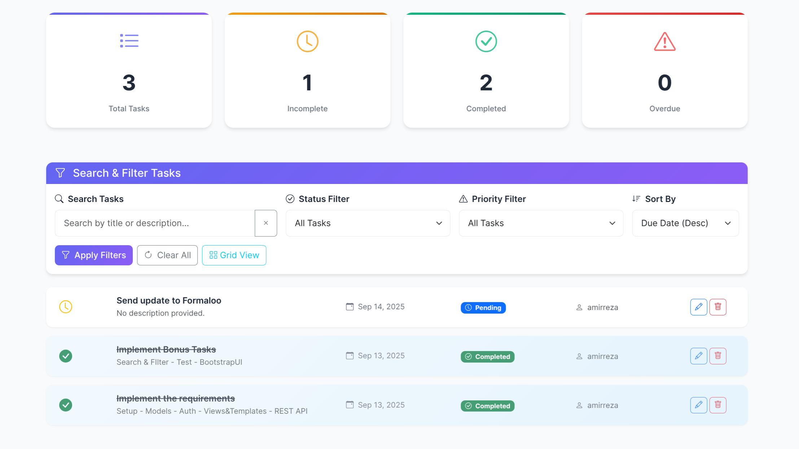
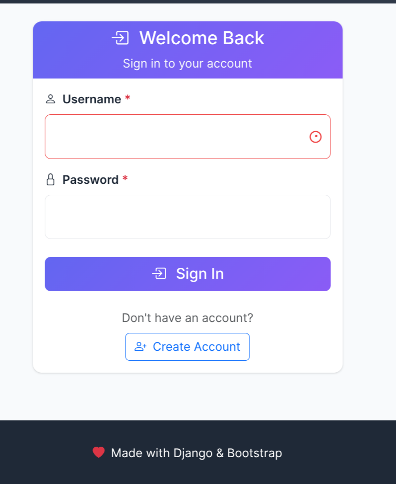
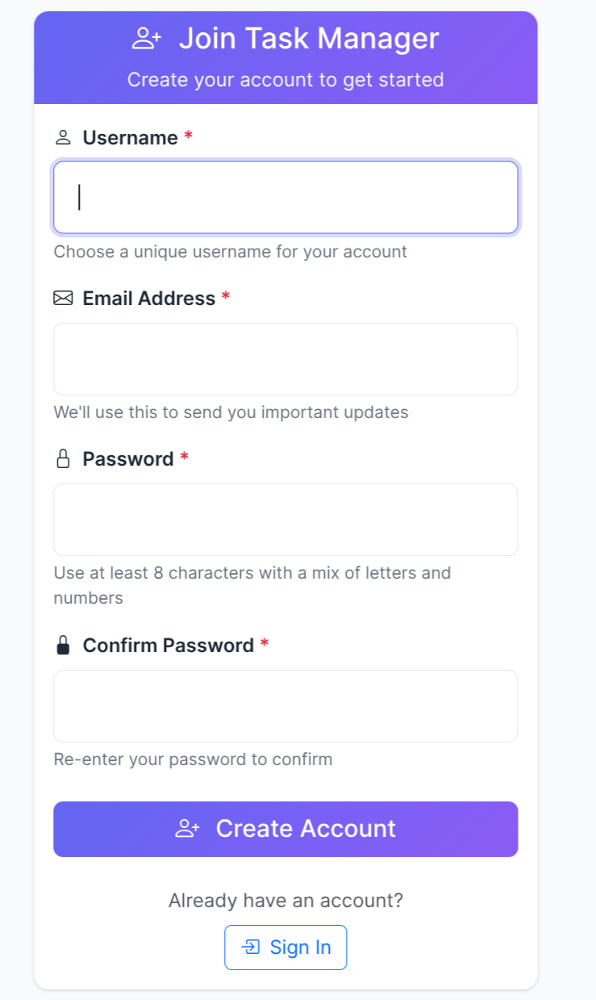

# Task Manager 📋

A modern Django-based task management application with intuitive web interface and REST API.

## ✨ Features

- **User Authentication**: Secure signup/login system
- **Task Management**: Create, edit, delete, and mark tasks as complete
- **Advanced Filtering**: Search and filter tasks by status, due date, and keywords
- **REST API**: Full CRUD operations with authentication and pagination
- **User Isolation**: Each user sees only their own tasks
- **Responsive Design**: Modern UI with Bootstrap 5

## 📱 Screenshots

### Dashboard

*Main dashboard with task statistics, search interface, and task cards*

### Login

*Clean login interface with modern design*

### Sign Up

*User registration form with validation*

## 🚀 Quick Start

1. **Clone the repository**
   ```bash
   git clone <repository-url>
   cd task-manager
   ```

2. **Set up environment**
   ```bash
   python -m venv venv
   source venv/bin/activate  # On Windows: venv\Scripts\activate
   pip install -r requirements.txt
   ```

3. **Run the application**
   ```bash
   python manage.py migrate
   python manage.py runserver
   ```

4. **Access the app**: http://127.0.0.1:8000/

## 🔌 API Usage

The REST API is available at `/api/tasks/` with token authentication.

```bash
# Get authentication token
curl -X POST -H "Content-Type: application/json" \
     -d '{"username": "your_username", "password": "your_password"}' \
     http://127.0.0.1:8000/api/auth/token/

# List tasks
curl -H "Authorization: Token your-token" http://127.0.0.1:8000/api/tasks/

# Create task
curl -X POST -H "Content-Type: application/json" \
     -H "Authorization: Token your-token" \
     -d '{"title": "New Task", "due_date": "2024-12-31"}' \
     http://127.0.0.1:8000/api/tasks/
```

## 🧪 Testing

```bash
python manage.py test
```

## 🛠️ Tech Stack

- **Backend**: Django 5.2.6
- **API**: Django REST Framework
- **Frontend**: Bootstrap 5, Bootstrap Icons
- **Database**: SQLite
- **Authentication**: Django's built-in auth system
- **Filtering**: django-filter